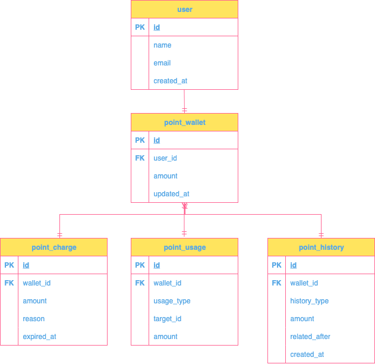

## 🗂️ ERD 다이어그램

---

## 📍구조 설명

### 1. `user`
- 포인트를 소유하는 사용자
- 기본 사용자 정보 (이름, 이메일 등)

| 컬럼명 | 설명 |
|--------|------|
| `id` (PK) | 사용자 고유 ID |
| `name` | 사용자 이름 |
| `email` | 이메일 |
| `created_at` | 생성일시 |

---

### 2. `point_wallet`
- 사용자별 포인트 지갑 (애그리거트 루트)
- 현재 총 잔액, 마지막 변경 시각 등 관리

| 컬럼명 | 설명 |
|--------|------|
| `id` (PK) | 지갑 ID |
| `user_id` (FK) | 소유 사용자 |
| `amount` | 총 잔액 |
| `updated_at` | 마지막 업데이트 |

---

### 3. `point_charge`
- 포인트 충전 트랜잭션
- 이벤트, 보상, 관리 충전 등 기록

| 컬럼명 | 설명 |
|--------|------|
| `id` (PK) | 충전 ID |
| `wallet_id` (FK) | 대상 지갑 |
| `amount` | 충전 금액 |
| `reason` | 충전 사유 |
| `expired_at` | 만료 예정일 |

---

### 4. `point_usage`
- 포인트 사용 내역
- 어디에, 얼마를 사용했는지 기록

| 컬럼명 | 설명 |
|--------|------|
| `id` (PK) | 사용 ID |
| `wallet_id` (FK) | 대상 지갑 |
| `usage_type` | 사용처 (주문, 선물 등) |
| `target_id` | 참조 대상 (예: 주문 ID) |
| `amount` | 사용 금액 |

---

### 5. `point_history`
- 포인트 변동 통합 기록
- 충전/사용/소멸 내역 조회용

| 컬럼명 | 설명 |
|--------|------|
| `id` (PK) | 히스토리 ID |
| `wallet_id` (FK) | 대상 지갑 |
| `change_type` | CHARGE, USAGE, EXPIRE |
| `amount` | 변동 금액 |
| `related_after` | 변동 후 잔액 |
| `created_at` | 기록 시각 |

---

## 🔗 테이블 관계

- `User (1)` ← `PointWallet (1)`
- `PointWallet (1)` ← `PointCharge`, `PointUsage`, `PointHistory` (N)
