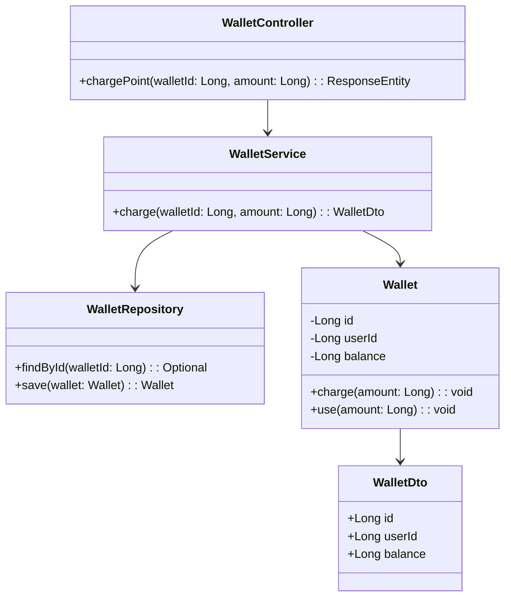

```mermaid
classDiagram
    class WalletController {
        +chargePoint(walletId: Long, amount: Long): ResponseEntity<WalletDto>
    }
    class WalletService {
        +charge(walletId: Long, amount: Long): WalletDto
    }
    class WalletRepository {
        +findById(walletId: Long): Optional<Wallet>
        +save(wallet: Wallet): Wallet
    }
    class Wallet {
        -Long id
        -Long userId
        -Long balance
        +charge(amount: Long): void
        +use(amount: Long): void
    }
    class WalletDto {
        +Long id
        +Long userId
        +Long balance
    }

    WalletController --> WalletService
    WalletService --> WalletRepository
    WalletService --> Wallet
    Wallet --> WalletDto
```