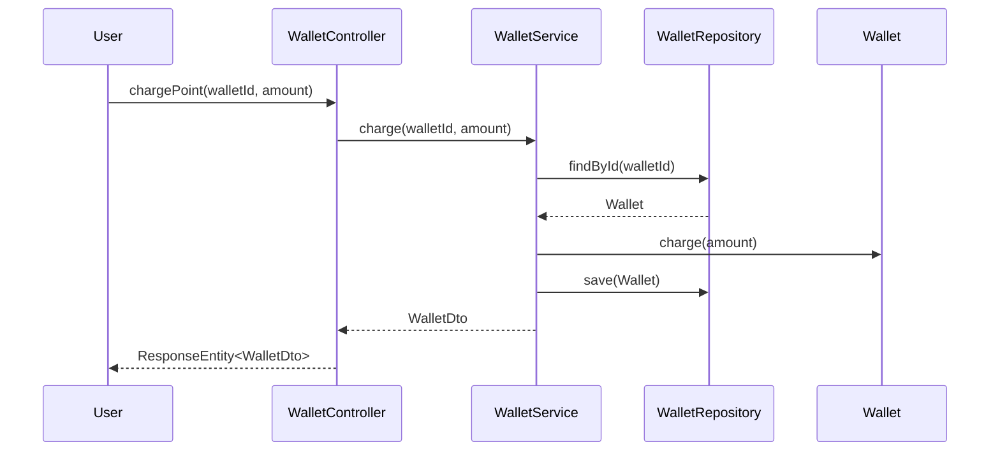

```mermaid
sequenceDiagram
    participant User
    participant WalletController
    participant WalletService
    participant WalletRepository

    User->>WalletController: chargePoint(walletId, amount)
    WalletController->>WalletService: charge(walletId, amount)
    WalletService->>WalletRepository: findById(walletId)
    WalletRepository-->>WalletService: Wallet
    WalletService->>Wallet: charge(amount)
    WalletService->>WalletRepository: save(Wallet)
    WalletService-->>WalletController: WalletDto
    WalletController-->>User: ResponseEntity<WalletDto>
```